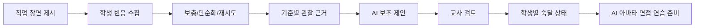
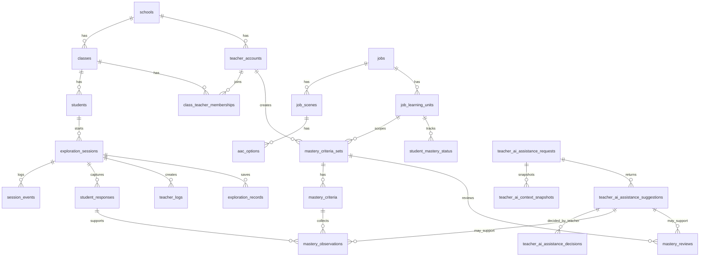

# Local PostgreSQL Data Model

이 디렉터리는 학교 로컬 PostgreSQL 서버를 기준으로 한 백엔드 데이터 모델을 둔다.
현재 앱은 프론트 프로토타입과 `localStorage` 상태가 중심이므로, 이 스키마가 v1 서버 구현의 기준이다.

## 설계 판단

기존 제안의 `schools/classes/students/jobs/sessions/events/responses/logs` 구조는 활동 기록에는 충분하지만, 숙달학습 판단에는 부족하다.
숙달학습에는 다음 정보가 독립적으로 남아야 한다.

- 교사가 무엇을 숙달 기준으로 정했는가
- 학생의 어떤 반응이 그 기준의 근거가 되었는가
- 보충/단순화/재시도 이력이 무엇인가
- AI가 어떤 도움을 제안했고 교사가 어떻게 처리했는가
- 언제 교사가 면접 연습으로 넘어가도 된다고 확인했는가

따라서 [schema.sql](/Users/eddy/Documents/mvp/server/db/schema.sql)는 기준 스키마 문서로 유지하고,
실제 적용은 `migrations/0001_initial.sql`, `migrations/0002_teacher_sessions.sql` 순서로 실행한다.
마이그레이션은 `npm run api:migrate`, 초기 로컬 seed는 `npm run api:seed`로 실행한다.

1. 운영 레이어: 학교, 교사, 학급, 학생, 직업 콘텐츠, 탐색 세션
2. 숙달학습 레이어: 학습 단위, 기준 묶음, 기준, 관찰 근거, 교사 검토, 학생별 상태
3. 교사 AI 보조 레이어: 정책, 요청, 맥락 스냅샷, AI 제안, 교사 결정

## 핵심 원칙

- 학생 실명은 필수값이 아니다. 기본 식별자는 `student_code`, `display_name`, `class_number`다.
- 장애명/진단명은 기본 스키마에 넣지 않는다.
- 학생 발화 원문은 기본 저장하지 않는다. `student_responses.raw_text`는 `raw_text_opt_in = true`일 때만 허용한다.
- `teacher_ai_context_snapshots.context_json`은 서버에서 최소화/수정한 맥락만 저장한다. 원문 발화 계열 필드는 raw-text 게이트 통과 전에는 redacted 값으로 저장하고, 원본 음성/blob 계열 값은 저장하지 않는다.
- AI 제공자 키는 `encrypted_api_key`로 서버에만 저장한다.
- AI는 학생 숙달 상태를 직접 확정하지 않는다.
- 최종 학습 판단과 면접 연습 전환은 교사 결정으로만 확정한다.

## 숙달학습 흐름



`E`는 선택적이다. 교사는 AI 도움 없이도 검토할 수 있다.

## 교사가 AI 도움을 받는 시점

`teacher_ai_assistance_requests.request_type`으로 명시한다.

| request_type | 시점 | 목적 |
| --- | --- | --- |
| `lesson_planning` | 수업 전 | 학습 단위, 숙달 기준, AAC 선택지, 지원 자료 초안 |
| `live_support` | 수업 중 | 도움 요청, 쉬기, 반복 재생 등 지원 필요 순간의 교사용 제안 |
| `session_summary` | 수업 후 | 탐색 세션 요약, 다음 수업 메모 초안 |
| `mastery_review` | 숙달 검토 | 기준별 근거 정리, 교사 확인 후보 제안 |
| `interview_preparation` | 면접 전환 전 | 면접 연습 질문, 난이도, 지원 방식 제안 |

교사 AI 보조는 반드시 아래 순서로 기록한다.

```text
teacher_ai_assistance_requests
-> teacher_ai_context_snapshots
-> teacher_ai_assistance_suggestions
-> teacher_ai_assistance_decisions
-> mastery_reviews / teacher_logs / exploration_records
```

금지되는 흐름:

```text
AI suggestion -> student_mastery_status 직접 업데이트
```

허용되는 흐름:

```text
AI suggestion -> teacher decision -> mastery review -> student mastery status
```

## ERD 요약



## 분석과 대시보드 기준

대시보드는 학생을 점수화하는 화면이 아니다. 읽기 경로는 다음 순서로 둔다.

1. 학급 단위: 어떤 학생에게 어떤 지원/검토가 필요한가
2. 학생 단위: 어떤 직업 학습 단위에서 근거가 쌓였는가
3. 기준 단위: 어떤 숙달 기준이 충분/부족한가
4. 세션 단위: 어떤 반응, 지원, 재시도가 근거가 되었는가
5. AI 보조 단위: AI가 무엇을 제안했고 교사가 채택/수정/거절했는가

`schema.sql`은 이를 위해 아래 뷰를 제공한다.

- `dashboard_mastery_progress`: 학생별 학습 단위 상태
- `dashboard_teacher_ai_assistance`: AI 보조 요청, 제안, 교사 결정 흐름
- `dashboard_session_activity`: 세션별 이벤트, 반응, 숙달 관찰 수

핵심 분석 grain은 아래와 같다.

| grain | 기준 테이블 | 쓰임 |
| --- | --- | --- |
| session | `exploration_sessions` | 학습/복습/면접 연습 phase 분리 |
| response | `student_responses` | 학생 반응과 원문 저장 여부 |
| mastery observation | `mastery_observations` | 기준별 근거 |
| mastery review | `mastery_reviews` | 교사 최종 검토 |
| mastery state | `student_mastery_status` | 현재 학습 상태 |
| teacher AI request | `teacher_ai_assistance_requests` | 교사의 AI 도움 사용 시점 |
| teacher AI decision | `teacher_ai_assistance_decisions` | AI 제안의 채택/수정/거절 |

## 면접 연습 확장

v1에서는 전체 면접 테이블을 만들지 않고 `exploration_sessions.phase = 'interview_practice'`와
`student_mastery_status.ready_for_interview_practice_at`으로 전환 경계를 예약한다.

v2에서 추가할 후보:

- `interview_scenarios`
- `interview_sessions`
- `interview_turns`
- `interview_feedback`

전환 조건은 `student_mastery_status.status = 'ready_for_interview_practice'`이고, 해당 상태는 `mastery_reviews`의 교사 확인 이후에만 갱신한다.

## 구현 순서

1. `schema.sql` 적용
2. `jobs`, `job_scenes`, `aac_options`, `job_learning_units` seed 작성
3. 교사용 `mastery_criteria_sets` 작성/수정 API
4. 탐색 세션 저장 API
5. `student_responses -> mastery_observations -> mastery_reviews -> student_mastery_status` 파이프라인
6. `teacher_ai_assistance_*` API
7. 대시보드 API는 세 뷰를 먼저 읽고, 필요 시 materialized view로 분리
